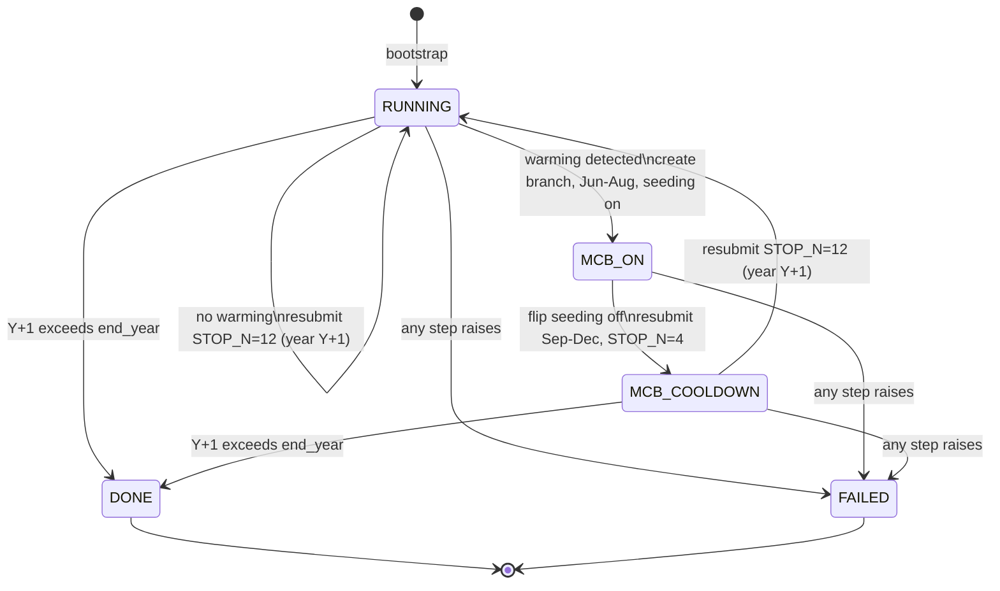
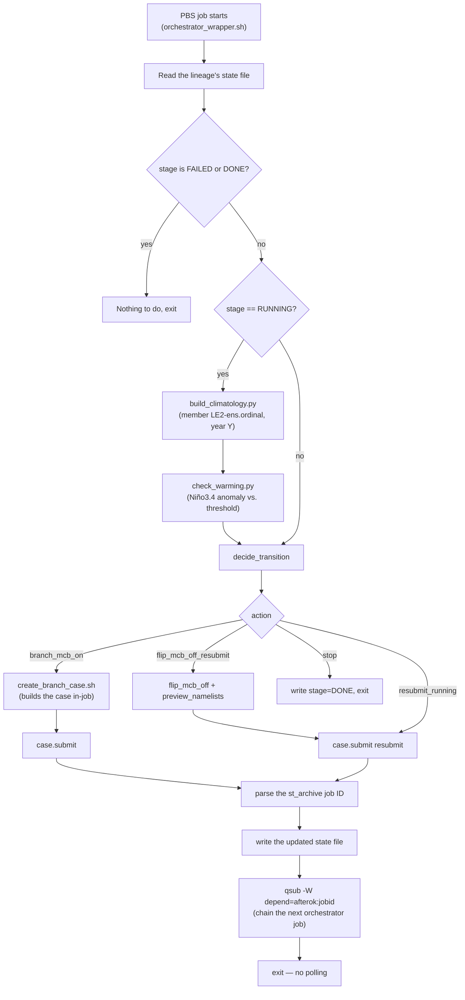

# ENSO-MCB Automated Cycle: How It Works

This document explains what the automation actually does and why. For how
to operate it (bootstrapping, monitoring, recovering from failures), see
[docs/RUNBOOK.md](docs/RUNBOOK.md). For the original design rationale and
open questions, see
[docs/superpowers/specs/2026-08-17-enso-mcb-automation-design.md](docs/superpowers/specs/2026-08-17-enso-mcb-automation-design.md).

## The experiment, in plain language

One CESM2-LE ensemble member ("a lineage") is run forward one simulated
year at a time. At the end of each year, the automation checks whether the
central Pacific (Niño3.4 region) has warmed enough to look like an
El Niño event. If it has, the automation branches off a new case with
Marine Cloud Brightening (MCB) seeding turned on for June–August, then
turns seeding back off and finishes out the year, before returning to the
normal year-by-year run. This repeats every year through the configured
end year (2100 by default).

Nobody watches a queue or hand-edits a script for this: each PBS job, when
it finishes, submits the next one itself. The chain runs unattended for
the life of the experiment, only stopping to wait for a human when
something actually fails.

## The three-stage cycle

A lineage is always in exactly one of these stages:

- **`RUNNING`** — the case is advancing a full calendar year at a time
  (`STOP_N=12`, `STOP_OPTION=nmonths`). At the end of each completed year,
  the automation checks for warming (see below).
- **`MCB_ON`** — a *new branch case*, created off that year's June 1
  restart, running June through August (`STOP_N=3`) with
  `MCB_seeding_amt=1`.
- **`MCB_COOLDOWN`** — the *same* case as `MCB_ON`, with seeding flipped
  off (`MCB_seeding_amt=0`) and resubmitted September through December
  (`STOP_N=4`) to land back on January 1.

Two terminal stages end the chain: **`DONE`** (the lineage reached the
configured end year) and **`FAILED`** (something went wrong and needs a
human — see the Runbook).



Branch/case naming is fully mechanical: the branch number always
increments by 1 from the previous case in the lineage, `refcase` is always
the case that just finished, and the branch start date is always `Y-06-01`.
There is no per-cycle human judgment call.

## The El Niño check

"Warming detected" means: this year's June area-weighted mean SST over the
Niño3.4 box (5°S–5°N, 170°W–120°W) minus a climatological June baseline is
at or above a configured threshold (default 1.0°C).

- **`build_climatology.py`** builds that baseline on demand: the mean June
  Niño3.4 SST over the 30 years immediately preceding the year being
  checked, from the CESM2-LE archive's monthly SST time-series files for
  the matching ensemble member. Results are cached per
  `(forcing_variant, member, year)` so a given year is only built once.
- **`check_warming.py`** computes the current year's Niño3.4 SST from the
  just-finished run's archived June history file, subtracts the
  climatology, and compares to the threshold. It prints one line of JSON,
  e.g. `{"year": 2054, "anomaly_c": 1.34, "warming": true}`. A non-zero
  exit code means the check itself failed (missing/corrupt data) — "no
  warming" is a normal, successful result, not a failure.

## One orchestrator invocation

Each PBS job in the chain runs the orchestrator exactly once. It performs
exactly one stage transition, then submits the next PBS job (a CESM
segment) and chains a fresh orchestrator job after it — then exits without
polling or waiting.



The dependency is deliberately on the **archive** (`st_archive`) job, not
the run job: `check_warming.py` reads from the archived output directory,
so the next orchestrator invocation must not start until archiving has
actually finished.

Any exception raised during steps B–O (a failed `xmlchange`, a
`case.submit`/`qsub` rejection, a missing climatology file, a failed
`case.build`) is caught, written to the state file as stage `FAILED` with
a reason, and the chain is *not* continued — no job P is submitted. See
the Runbook for the two distinct ways a lineage can stop and how to
recover from each.

## Components

| File | Role |
| --- | --- |
| `enso_mcb_orchestrator.py` | The PBS job entry point. `run_cycle()` performs exactly one transition; `bootstrap()` seeds a lineage's first state and segment; `mark_failed()` records terminal failures. |
| `enso_mcb_decision.py` | `decide_transition()` — the branch/state-machine logic itself. A pure function: state + warming result + end year in, a `Transition` out. No I/O, no CESM calls — this is what the automated tests exercise directly. |
| `enso_mcb_jobs.py` | Every side-effecting operation: `xmlchange` wrappers, `case.submit`/`qsub` calls, invoking `build_climatology.py`/`check_warming.py`/`create_branch_case.sh` as subprocesses, and `submit_orchestrator_self()` (the self-chaining `qsub`). |
| `enso_mcb_state.py` | The `CycleState` dataclass, `Stage` constants, and atomic JSON load/save (write to a temp file, then `os.replace`). |
| `enso_mcb_config.py` / `enso_mcb_config.yaml` | Required-key validation and the fixed, per-deployment knobs (paths, project, threshold, end year, etc.). |
| `check_warming.py` | The El Niño check: Niño3.4 SST anomaly vs. a climatology reference, threshold comparison, JSON result. |
| `build_climatology.py` | Builds (and caches) the rolling 30-year June Niño3.4 climatology baseline used by `check_warming.py`. |
| `create_branch_case.sh` | Parameterized (via environment variables) CESM branch-case creator, called programmatically by the orchestrator for every `MCB_ON` branch. Supports `DRY_RUN=1` to print the commands it would run instead of executing them. |
| `create_ENSO_controller_case.sh` | The original, hand-edited, one-off script this pipeline grew out of. Still used manually to create the very *first* case in a lineage, before the orchestrator's `--bootstrap` mode adopts it. |
| `orchestrator_wrapper.sh` | The actual PBS script `qsub` submits: sets `#PBS` resource directives, `cd`s to the repo checkout, resolves the venv's Python, and runs `enso_mcb_orchestrator.py`. |

## State file

One JSON file per lineage (e.g. `state/enso_mcb_1051.json`), holding:

```json
{
  "lineage_name": "enso_mcb_1051",
  "case_name": "b.e21.BSSP370smbb.f09_g17.ENSO_JJASONDJF_375cm3.1051.branch.009",
  "stage": "MCB_ON",
  "branch_number": 9,
  "year": 2054,
  "failed_from_stage": null,
  "failure_reason": null
}
```

`failed_from_stage` and `failure_reason` are only populated when
`stage == "FAILED"`; they record which stage the lineage was in and why it
stopped, so an operator knows where to resume from after fixing the
underlying problem.

## Failure and stopping

There are two distinct ways a lineage stops that look different from the
outside:

- The orchestrator's own Python raises — this **is** recorded as
  `FAILED` in the state file, with a reason.
- A submitted CESM run or archive job fails on the HPC system — the
  orchestrator never observes this (it exits right after submitting), so
  the state file keeps showing a normal, non-terminal stage forever, and
  the chain simply goes quiet.

Telling these apart and recovering from each is covered in full in
[docs/RUNBOOK.md](docs/RUNBOOK.md#recovering-from-a-failure).
